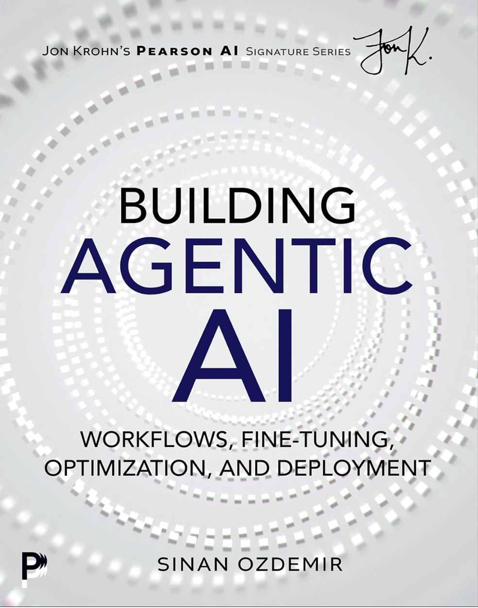

<div align="center">
  
</div>

# Building Agentic AI Book - Code Repository

**Buy the Book on Amazon:** [https://a.co/d/eaTeURV](https://a.co/d/eaTeURV)

This repository contains code examples, experiments, and implementations for the **Building Agentic AI** book by Sinan Ozdemir. The book offers a practical, durable foundation for understanding how modern AI systems are built, why they behave the way they do, and how to push them to their limits.

## About the Book

**Building Agentic AI** is a practical guide for builders. If you're a developer deploying your first model, a data scientist making sense of embeddings and agents, or a founder exploring how AI workflows can reshape your product, this repository provides the code and examples to accompany your learning journey.

The book is organized in three acts:
- **Act I: Foundations** — LLMs, embeddings, retrieval, and workflows for reliable, cost-effective, scalable systems
- **Act II: Agents** — Designing, deploying, and evaluating systems that don't just respond, but act
- **Act III: Optimization** — Fine-tuning, quantization, distillation, and tools to push performance while maintaining efficiency

## Quick Navigation

- [Prerequisites](#prerequisites)
- [Case Studies](#case-studies)
  - [Case Study 1: Text to SQL Workflow](#case-study-1-text-to-sql-workflow)
  - [Case Study 2: LLM Evaluation](#case-study-2-llm-evaluation)
  - [Case Study 3: LLM Experimentation](#case-study-3-llm-experimentation)
  - [Case Study 4: "Simple" Summary Prompt](#case-study-4-simple-summary-prompt)
  - [Case Study 5: From RAG to Agents](#case-study-5-from-rag-to-agents)
  - [Case Study 6: AI Rubrics for Grading](#case-study-6-ai-rubrics-for-grading)
  - [Case Study 7: AI SDR with MCP](#case-study-7-ai-sdr-with-mcp)
  - [Case Study 8: Prompt Engineering Agents](#case-study-8-prompt-engineering-agents)
  - [Case Study 9: Deep Research + Agentic Workflows](#case-study-9-deep-research--agentic-workflows)
  - [Case Study 10: Agentic Tool Selection Performance](#case-study-10-agentic-tool-selection-performance)
  - [Case Study 11: Benchmarking Reasoning Models](#case-study-11-benchmarking-reasoning-models)
  - [Case Study 12: Computer Use](#case-study-12-computer-use)
  - [Case Study 13: Classification vs Multiple Choice](#case-study-13-classification-vs-multiple-choice)
  - [Case Study 14: Domain Adaptation](#case-study-14-domain-adaptation)
  - [Case Study 15: Speculative Decoding](#case-study-15-speculative-decoding)
  - [Case Study 16: Voice Bot](#case-study-16-voice-bot)
  - [Case Study 17: Fine-Tuning Matryoshka Embeddings](#case-study-17-fine-tuning-matryoshka-embeddings)
- [Common Patterns](#common-patterns)
- [Troubleshooting](#troubleshooting)
- [Contributing](#contributing)

## Prerequisites

### Python Version
- Python 3.8 or higher recommended
- Python 3.10+ for optimal compatibility with all libraries

### Common Dependencies

Most case studies use these core libraries:
- `langchain` and `langgraph` - Agent frameworks
- `langchain-openai` - OpenAI integration
- `openai` - OpenAI API client
- `chromadb` - Vector database
- `pydantic` - Structured outputs and data validation
- `fastapi` / `flask` - Web frameworks
- `streamlit` - Interactive UIs
- `playwright` - Browser automation
- `pandas` / `numpy` - Data manipulation

### Environment Variables

**IMPORTANT:** Never commit your actual API keys to the repository. Always use environment variables or `.env` files (which are gitignored).

You'll need API keys for various services. We've provided `.env.example` files in key directories as templates:

1. **Copy the example file to create your own `.env` file:**
   ```bash
   # Root directory
   cp .env.example .env
   
   # Or for specific case studies
   cp sdr_multi_agent/.env.example sdr_multi_agent/.env
   cp text_to_sql/.env.example text_to_sql/.env
   cp codeact_browser/.env.example codeact_browser/.env
   ```

2. **Edit the `.env` file and add your actual API keys:**
   ```bash
   # Required for most case studies
   OPENAI_API_KEY=your_actual_openai_api_key_here
   OPENROUTER_API_KEY=your_actual_openrouter_api_key_here
   
   # For specific case studies
   GROQ_API_KEY=your_actual_groq_api_key  # Case Study 16: Voice Bot
   SERPAPI_API_KEY=your_actual_serpapi_key  # Case Study 9: Deep Research
   FIRECRAWL_API_KEY=your_actual_firecrawl_key  # Case Study 9: Deep Research
   RESEND_API_KEY=your_actual_resend_key  # Case Study 7: AI SDR
   TWILIO_API_KEY=your_actual_twilio_key  # Case Study 16: Voice Bot
   ANTHROPIC_API_KEY=your_actual_anthropic_key  # For Claude models
   LANGSMITH_API_KEY=your_actual_langsmith_key  # Optional: for tracing
   ```

3. **For Jupyter notebooks:** Some notebooks use `%env` magic commands. You can either:
   - Set environment variables before starting Jupyter: `export OPENROUTER_API_KEY=your_key`
   - Or update the notebook's first cell to use your actual key (but remember not to commit it!)

**Security Note:** All `.env` files are automatically ignored by git. Never commit actual API keys to the repository.

### Installation

1. Clone the repository:
```bash
git clone <repository-url>
cd applied-ai-book
```

2. Create a virtual environment (recommended):
```bash
python -m venv venv
source venv/bin/activate  # On Windows: venv\Scripts\activate
```

3. Install dependencies for specific case studies (see individual case study sections)

## Case Studies

### Case Study 1: Text to SQL Workflow

**Description:** Build a system that converts natural language questions to SQL queries using RAG (Retrieval-Augmented Generation). This implementation achieves 30% better SQL accuracy than raw LLMs with half the token cost.

**Key Concepts:** LangGraph workflows, RAG pipelines, ChromaDB vector storage, document retrieval, SQL generation

**Code Location:** [`text_to_sql/`](text_to_sql/)

**Setup:**
```bash
cd text_to_sql/prototype
pip install -r requirements.txt
# Set OPENAI_API_KEY in .env file
python app.py
```

**Files:**
- Main implementation: [`text_to_sql/src/text_to_sql_rag/sql_rag_langgraph.ipynb`](text_to_sql/src/text_to_sql_rag/sql_rag_langgraph.ipynb) - LangGraph RAG workflow notebook
- Core workflow: [`text_to_sql/src/text_to_sql_rag/rag_graph.py`](text_to_sql/src/text_to_sql_rag/rag_graph.py) - RAG workflow implementation
- Database management: [`text_to_sql/src/text_to_sql_rag/rag_db.py`](text_to_sql/src/text_to_sql_rag/rag_db.py) - Database and vector store setup
- Web interface: [`text_to_sql/prototype/app.py`](text_to_sql/prototype/app.py) - Flask web application
- Utilities: [`text_to_sql/src/text_to_sql_rag/utils.py`](text_to_sql/src/text_to_sql_rag/utils.py)

**Dependencies:** See [`text_to_sql/prototype/requirements.txt`](text_to_sql/prototype/requirements.txt)

**Key Features:**
- LangGraph-based RAG workflow
- ChromaDB for vector storage
- Multiple database support (Formula 1, Superhero, Financial, etc.)
- Interactive Flask web interface
- Evidence retrieval with similarity scores

---

### Case Study 2: LLM Evaluation

**Description:** An exploration of how well the SQL system from Case Study 1 actually works. This includes comprehensive evaluation metrics, accuracy measurements, and performance analysis.

**Key Concepts:** Evaluation methodologies, accuracy metrics, performance benchmarking, SQL correctness validation

**Code Location:** [`text_to_sql/src/choosing_generator/`](text_to_sql/src/choosing_generator/)

**Setup:**
```bash
cd text_to_sql/src/choosing_generator
# Install dependencies from parent directory
python run_batch_evaluation.py
python visualize_model_performance.py
```

**Files:**
- Batch evaluation: [`text_to_sql/src/choosing_generator/run_batch_evaluation.py`](text_to_sql/src/choosing_generator/run_batch_evaluation.py)
- Performance visualization: [`text_to_sql/src/choosing_generator/visualize_model_performance.py`](text_to_sql/src/choosing_generator/visualize_model_performance.py)
- Multi-model evaluation: [`text_to_sql/src/choosing_generator/run_multi_model_evaluation.py`](text_to_sql/src/choosing_generator/run_multi_model_evaluation.py)
- Evaluation results: Multiple CSV files in `text_to_sql/src/choosing_generator/` with batch evaluation results

**Key Features:**
- SQL accuracy evaluation across multiple models
- Performance metrics and visualization
- Batch processing for large-scale evaluation
- Model comparison and analysis

---

### Case Study 3: LLM Experimentation

**Description:** Run systematic tests on prompts, models, and embedding models. Learn how even the smallest changes can 2x your performance when you experiment efficiently.

**Key Concepts:** Systematic experimentation, prompt optimization, embedding model comparison, A/B testing, performance optimization

**Code Location:** [`text_to_sql/src/choosing_generator/`](text_to_sql/src/choosing_generator/) and [`prompting/`](prompting/)

**Setup:**
```bash
cd text_to_sql/src/choosing_generator
# Run prompt engineering experiments
jupyter notebook prompt_engineering_generator.ipynb

# Or run multi-model evaluation
python run_multi_model_evaluation.py
```

**Files:**
- Prompt engineering: [`text_to_sql/src/choosing_generator/prompt_engineering_generator.ipynb`](text_to_sql/src/choosing_generator/prompt_engineering_generator.ipynb)
- Multi-model evaluation: [`text_to_sql/src/choosing_generator/run_multi_model_evaluation.py`](text_to_sql/src/choosing_generator/run_multi_model_evaluation.py)
- Prompt caching: [`prompting/prompt_cache_haystack.ipynb`](prompting/prompt_cache_haystack.ipynb) - Prompt caching experiments
- Model definitions: [`text_to_sql/src/choosing_generator/models.py`](text_to_sql/src/choosing_generator/models.py)

**Key Features:**
- Systematic testing framework
- Prompt optimization techniques
- Embedding model experiments
- Performance comparison across models
- Cost and latency analysis

---

### Case Study 4: "Simple" Summary Prompt

**Description:** Discover why LLMs favor content at the start and end of prompts. This positional bias is breaking your RAG systems and chatbots, and you may not even know it.

**Key Concepts:** Positional bias, embedding similarity, prompt engineering, RAG system optimization

**Code Location:** [`prompting/`](prompting/)

**Setup:**
```bash
cd prompting
jupyter notebook summary_positional_bias.ipynb
```

**Files:**
- Main analysis: [`prompting/summary_positional_bias.ipynb`](prompting/summary_positional_bias.ipynb) - Positional bias discovery and analysis
- Chunked analysis: [`prompting/summary_positional_bias_chunk.ipynb`](prompting/summary_positional_bias_chunk.ipynb) - Chunked document analysis
- MMLU dataset: [`prompting/mmlu_positional_bias.ipynb`](prompting/mmlu_positional_bias.ipynb) - Positional bias in MMLU dataset
- Results: CSV files with positional bias metrics

**Key Features:**
- Embedding similarity analysis
- Positional bias discovery
- Impact on RAG system performance
- Visualization of bias patterns

---

### Case Study 5: From RAG to Agents

**Description:** Convert a workflow into an agent that makes its own decisions using tools. Agents handle the weird edge cases your workflow never imagined, but at what cost (literally)?

**Key Concepts:** ReAct agents, LangGraph, tool usage, agent decision-making, cost analysis

**Code Location:** [`text_to_sql/agent/`](text_to_sql/agent/)

**Setup:**
```bash
cd text_to_sql/agent
jupyter notebook react_agent_sql.ipynb
```

**Files:**
- ReAct agent: [`text_to_sql/agent/react_agent_sql.ipynb`](text_to_sql/agent/react_agent_sql.ipynb) - Main ReAct agent implementation
- Agent utilities: [`text_to_sql/agent/utils.py`](text_to_sql/agent/utils.py) - Helper functions
- Long-term memory: [`text_to_sql/agent/long_term_memory_experiment.ipynb`](text_to_sql/agent/long_term_memory_experiment.ipynb) - Memory experiments
- Memory experiment part 2: [`text_to_sql/agent/long_term_memory_experiment_part_deux.ipynb`](text_to_sql/agent/long_term_memory_experiment_part_deux.ipynb)
- Evaluation results: [`text_to_sql/agent/eval_results.csv`](text_to_sql/agent/eval_results.csv)

**Key Features:**
- LangGraph ReAct agent implementation
- Tool-based decision making
- Edge case handling
- Long-term memory experiments
- Cost and performance comparison with workflows

---

### Case Study 6: AI Rubrics for Grading

**Description:** Create scoring systems to evaluate AI outputs consistently and with mitigated bias. Less arguing about quality—more clear, measurable criteria.

**Key Concepts:** Structured outputs, Pydantic models, evaluation rubrics, bias mitigation, consistent scoring

**Code Location:** [`policy_bot/`](policy_bot/)

**Setup:**
```bash
cd policy_bot
pip install -r requirements.txt
# Set OPENROUTER_API_KEY in environment
python -c "from ai.rubric import get_structured_scorer; scorer = get_structured_scorer()"
```

**Files:**
- Rubric system: [`policy_bot/ai/rubric.py`](policy_bot/ai/rubric.py) - Structured scoring system with Pydantic
- Policy agent: [`policy_bot/ai/agent.py`](policy_bot/ai/agent.py) - Policy agent using rubrics
- Evaluation notebooks: [`policy_bot/rubric_grade_domain_adapt.ipynb`](policy_bot/rubric_grade_domain_adapt.ipynb)
- Results: CSV files with scoring results

**Key Features:**
- Pydantic structured outputs for consistent scoring
- 0-3 scoring scale with detailed reasoning
- Bias mitigation in evaluation
- Automated rubric-based grading
- Integration with policy agents

---

### Case Study 7: AI SDR with MCP

**Description:** Build multiple agents that research contacts and send emails. Your outreach can finally sound human at scale.

**Key Concepts:** Multi-agent systems, MCP (Model Context Protocol), Flask applications, Celery async tasks, agent orchestration

**Code Location:** [`sdr_multi_agent/`](sdr_multi_agent/)

**Setup:**
```bash
cd sdr_multi_agent
# Start Docker services (RabbitMQ, etc.)
docker-compose up -d

# Install dependencies
cd flask_app
pip install -r requirements.txt

# Run Flask app
python app.py
```

**Files:**
- Flask application: [`sdr_multi_agent/flask_app/app.py`](sdr_multi_agent/flask_app/app.py) - Main Flask app with sync/async endpoints
- Agent builder: [`sdr_multi_agent/flask_app/agent_builder.py`](sdr_multi_agent/flask_app/agent_builder.py) - Generic agent builder with MCP integration
- System prompts: [`sdr_multi_agent/flask_app/prompts.py`](sdr_multi_agent/flask_app/prompts.py)
- Celery tasks: [`sdr_multi_agent/flask_app/celery_app.py`](sdr_multi_agent/flask_app/celery_app.py)
- MCP servers:
  - [`sdr_multi_agent/mcp_servers/research_server/mcp_server.py`](sdr_multi_agent/mcp_servers/research_server/mcp_server.py)
  - [`sdr_multi_agent/mcp_servers/hubspot_server/mcp_server.py`](sdr_multi_agent/mcp_servers/hubspot_server/mcp_server.py)
  - [`sdr_multi_agent/mcp_servers/email_server/`](sdr_multi_agent/mcp_servers/email_server/) - TypeScript email server
- Agent configs: JSON files in `sdr_multi_agent/flask_app/` (e.g., `email_agent.json`, `lead_gen_config.json`)

**Dependencies:** See [`sdr_multi_agent/flask_app/requirements.txt`](sdr_multi_agent/flask_app/requirements.txt)

**Key Features:**
- Multi-agent system architecture
- MCP server integration
- Celery for async task processing
- Configurable agent system with JSON configs
- Persistent conversation memory
- Research and email automation

---

### Case Study 8: Prompt Engineering Agents

**Description:** Create agents that follow company policies using synthetic test data as a measuring stick. See how one single sentence in a prompt can move accuracy from 44% to 70%.

**Key Concepts:** Prompt engineering, policy compliance, accuracy optimization, synthetic test data, agent evaluation

**Code Location:** [`policy_bot/`](policy_bot/)

**Setup:**
```bash
cd policy_bot
pip install -r requirements.txt
jupyter notebook agent_prompting_test.ipynb
```

**Files:**
- Main experiment: [`policy_bot/agent_prompting_test.ipynb`](policy_bot/agent_prompting_test.ipynb) - Prompt engineering experiments
- Mini version: [`policy_bot/agent_prompting_test_mini.ipynb`](policy_bot/agent_prompting_test_mini.ipynb) - Smaller test version
- Policy agent: [`policy_bot/ai/agent.py`](policy_bot/ai/agent.py) - Agent implementation
- Dataset building: [`policy_bot/build_dataset.ipynb`](policy_bot/build_dataset.ipynb) - Test dataset creation
- Results: 
  - [`policy_bot/agent_prompting_test_openai_gpt-4.1.csv`](policy_bot/agent_prompting_test_openai_gpt-4.1.csv)
  - [`policy_bot/agent_prompting_test_openai_gpt-4.1-nano.csv`](policy_bot/agent_prompting_test_openai_gpt-4.1-nano.csv)

**Dependencies:** See [`policy_bot/requirements.txt`](policy_bot/requirements.txt)

**Key Features:**
- Prompt optimization techniques
- Accuracy improvements (44% to 70%)
- Synthetic test data generation
- Policy compliance evaluation
- Tool call tracking and analysis

---

### Case Study 9: Deep Research + Agentic Workflows

**Description:** Combine structured workflows with agent flexibility for research tasks. Get reliability without sacrificing adaptability.

**Key Concepts:** LangGraph workflows, planning and replanning, step execution, structured workflows, agent flexibility

**Code Location:** [`deep_research/`](deep_research/)

**Setup:**
```bash
cd deep_research
pip install -r requirements.txt

# For Streamlit UI
pip install -r streamlit_requirements.txt
streamlit run streamlit_app.py

# Or run notebook
jupyter notebook deep_research_langgraph_demo.ipynb
```

**Files:**
- Main workflow: [`deep_research/deep_research_graph.py`](deep_research/deep_research_graph.py) - LangGraph workflow implementation
- Planning logic: [`deep_research/planning.py`](deep_research/planning.py) - Plan generation and replanning
- Step executor: [`deep_research/step_executor.py`](deep_research/step_executor.py) - Step execution with ReAct agents
- Streamlit UI: [`deep_research/streamlit_app.py`](deep_research/streamlit_app.py) - Interactive web interface
- Demo notebook: [`deep_research/deep_research_langgraph_demo.ipynb`](deep_research/deep_research_langgraph_demo.ipynb)
- Tests: [`deep_research/tests/test_planning.py`](deep_research/tests/test_planning.py), [`deep_research/tests/test_step_executor.py`](deep_research/tests/test_step_executor.py)

**Dependencies:** 
- [`deep_research/requirements.txt`](deep_research/requirements.txt)
- [`deep_research/streamlit_requirements.txt`](deep_research/streamlit_requirements.txt)

**Key Features:**
- Structured workflows with agent flexibility
- Planning and replanning system
- Step-by-step research execution
- Real-time streaming events
- Performance analytics
- Web scraping and search integration

**Environment Variables Needed:**
- `OPENROUTER_API_KEY` - For LLM access
- `SERPAPI_API_KEY` - For Google search
- `FIRECRAWL_API_KEY` - For web scraping

---

### Case Study 10: Agentic Tool Selection Performance

**Description:** Test how well different LLMs choose the right tools. Tool order in prompts can shift accuracy by 40%.

**Key Concepts:** Tool selection, positional bias, MCP servers, agent performance evaluation, accuracy analysis

**Code Location:** [`agent_positional_bias/`](agent_positional_bias/)

**Setup:**
```bash
cd agent_positional_bias
jupyter notebook "LangGraph_React - MCP + Tool Selection.ipynb"
```

**Files:**
- Main experiment: [`agent_positional_bias/LangGraph_React - MCP + Tool Selection.ipynb`](agent_positional_bias/LangGraph_React%20-%20MCP%20+%20Tool%20Selection.ipynb) - Tool selection experiments
- Prompt-only version: [`agent_positional_bias/PROMPT ONLY LangGraph_React - MCP + Tool Selection.ipynb`](agent_positional_bias/PROMPT%20ONLY%20LangGraph_React%20-%20MCP%20+%20Tool%20Selection.ipynb)
- Reasoning edition: [`agent_positional_bias/positional bias reasoning edition.ipynb`](agent_positional_bias/positional%20bias%20reasoning%20edition.ipynb)
- MCP server: [`agent_positional_bias/mcp_server.py`](agent_positional_bias/mcp_server.py) - Basic MCP server example
- Similarity-based: [`agent_positional_bias/similarity_based_mcp.py`](agent_positional_bias/similarity_based_mcp.py) - Similarity-based tool selection
- Random MCP: [`agent_positional_bias/random_mcp_server.py`](agent_positional_bias/random_mcp_server.py)
- Results: 
  - [`agent_positional_bias/results_agent_positional_bias.csv`](agent_positional_bias/results_agent_positional_bias.csv)
  - [`agent_positional_bias/results_agent_positional_bias_reasoning.csv`](agent_positional_bias/results_agent_positional_bias_reasoning.csv)
  - [`agent_positional_bias/results_agent_positional_bias_embeddings.csv`](agent_positional_bias/results_agent_positional_bias_embeddings.csv)

**Key Features:**
- Tool selection accuracy testing
- Positional bias analysis (40% accuracy shifts)
- Comparison across multiple LLMs
- Reasoning vs non-reasoning model comparison
- Visualization of tool selection patterns

---

### Case Study 11: Benchmarking Reasoning Models

**Description:** Compare reasoning models like o1 and Claude against standard LLMs. They may even lose to cheaper models on real tasks—we'll see!

**Key Concepts:** Reasoning models, chain-of-thought, model benchmarking, cost/performance analysis, o1, Claude reasoning

**Code Location:** [`reasoning_llms/`](reasoning_llms/)

**Setup:**
```bash
cd reasoning_llms
jupyter notebook benchmarking_reasoning_models.ipynb
```

**Files:**
- Main benchmarking: [`reasoning_llms/benchmarking_reasoning_models.ipynb`](reasoning_llms/benchmarking_reasoning_models.ipynb) - Comprehensive benchmarking notebook
- Reasoning agents: [`reasoning_llms/reasoning_llm_agents.ipynb`](reasoning_llms/reasoning_llm_agents.ipynb) - Agent implementations
- Introduction: [`reasoning_llms/intro_to_reasoning_models.ipynb`](reasoning_llms/intro_to_reasoning_models.ipynb) - Introduction to reasoning models
- Tree of Thoughts: [`reasoning_llms/tot.ipynb`](reasoning_llms/tot.ipynb) - Tree of Thoughts implementation
- Wordle solver: [`reasoning_llms/tot wordle.ipynb`](reasoning_llms/tot%20wordle.ipynb) - ToT applied to Wordle
- Results: [`reasoning_llms/reasoning_results_math_qa.csv`](reasoning_llms/reasoning_results_math_qa.csv)

**Key Features:**
- Reasoning model comparison
- Cost and performance analysis
- Tree of Thoughts implementation
- Real-world task evaluation
- Performance visualization

---

### Case Study 12: Computer Use

**Description:** Build agents that control browsers and applications through screenshots. Your agent can finally use software you can't API into.

**Key Concepts:** Screenshot-based automation, GUI control, browser automation, computer vision, agent control

**Code Location:** [`reasoning_llms/computer_use/`](reasoning_llms/computer_use/)

**Setup:**
```bash
cd reasoning_llms/computer_use
jupyter notebook using_computer_use.ipynb
```

**Files:**
- Core implementation: [`reasoning_llms/computer_use/simple_computer_use.py`](reasoning_llms/computer_use/simple_computer_use.py) - Main computer use implementation
- Usage notebook: [`reasoning_llms/computer_use/using_computer_use.ipynb`](reasoning_llms/computer_use/using_computer_use.ipynb) - How to use the system
- Benchmarking: [`reasoning_llms/computer_use/benchmarking reasoning_model_computer_use.ipynb`](reasoning_llms/computer_use/benchmarking%20reasoning_model_computer_use.ipynb)
- Screenshot app: [`reasoning_llms/computer_use/screenshot_app/`](reasoning_llms/computer_use/screenshot_app/) - Electron-based screenshot application
- Dataset: [`reasoning_llms/computer_use/uipad_dataset/`](reasoning_llms/computer_use/uipad_dataset/) - UI interaction dataset

**Key Features:**
- Screenshot-based UI automation
- Browser and application control
- GUI interaction through vision
- Benchmarking and evaluation
- Real-world application control

---

### Case Study 13: Classification vs Multiple Choice

**Description:** Compare fine-tuning against multiple choice prompting for classification. The winner might depend on if you have 100 or 10,000 examples.

**Key Concepts:** Fine-tuning, classification, multiple choice prompting, model comparison, data efficiency

**Code Location:** [`finetuning/app_review_clf/`](finetuning/app_review_clf/) and root [`clf.ipynb`](clf.ipynb)

**Colab Notebooks:**
- Fine-tuning BERT for app reviews: [Google Colab](https://colab.research.google.com/drive/1z2sMZ_A05_VGYqpHBgabvcV0V4INYhQ4#scrollTo=QQAdv6RBNees)
- App review calibration: [Google Colab](https://colab.research.google.com/drive/1460HIj1mFmPA1iOoVVh5uapBkrLZyopI#scrollTo=cb0i0fjeiIzv)

**Setup:**
```bash
# For fine-tuning approach
cd finetuning/app_review_clf
jupyter notebook openai_app_review_ft.ipynb

# For classification comparison
cd ../..
jupyter notebook clf.ipynb
```

**Files:**
- Fine-tuning notebook: [`finetuning/app_review_clf/openai_app_review_ft.ipynb`](finetuning/app_review_clf/openai_app_review_ft.ipynb) - OpenAI fine-tuning implementation
- Classification comparison: [`clf.ipynb`](clf.ipynb) - Comparison between fine-tuning and prompting
- Training data: [`finetuning/app_review_clf/openai_training_data/`](finetuning/app_review_clf/openai_training_data/) - JSONL training files
- Results: PNG files with performance visualizations

**Key Features:**
- Fine-tuning vs prompting comparison
- Classification accuracy analysis
- Data efficiency evaluation
- Cost and performance trade-offs
- App review sentiment classification

---

### Case Study 14: Domain Adaptation

**Description:** Fine-tune Qwen on domain-specific documents. Generic models become experts in your exact business rules.

**Key Concepts:** Domain adaptation, fine-tuning, Qwen model, policy compliance, business rule learning

**Code Location:** [`policy_bot/`](policy_bot/) and [`finetuning/domain_adaptation/`](finetuning/domain_adaptation/)

**Colab Notebook:**
- Fine-tuning Qwen for domain adaptation: [Google Colab](https://colab.research.google.com/drive/1eZzTJ5dNtbeh2RZS-kV7DD7jDHFqS4qG#scrollTo=yqxqAZ7KJ4oL)

**Setup:**
```bash
cd policy_bot
jupyter notebook rubric_grade_domain_adapt.ipynb
```

**Files:**
- Domain adaptation evaluation: [`policy_bot/rubric_grade_domain_adapt.ipynb`](policy_bot/rubric_grade_domain_adapt.ipynb) - Evaluation of domain-adapted models
- Fine-tuning checkpoints: [`finetuning/domain_adaptation/`](finetuning/domain_adaptation/) - Model checkpoints and configs
- Policy agent: [`policy_bot/ai/agent.py`](policy_bot/ai/agent.py) - Agent using domain-adapted models
- Results: CSV files with before/after fine-tuning comparisons

**Key Features:**
- Qwen model fine-tuning
- Airbnb policy domain adaptation
- Domain-specific expertise
- Before/after performance comparison
- Business rule learning

---

### Case Study 15: Speculative Decoding

**Description:** Speed up inference by having a small model draft for a large model. Same exact outputs, 2-3x faster, sometimes.

**Key Concepts:** Speculative decoding, inference acceleration, draft models, performance optimization

**Colab Notebook:**
- Qwen speculative decoding: [Google Colab](https://colab.research.google.com/drive/1P03P_hYP6H_zBmqlhvyOgTVvO737rBls)

**Code Location:** *Implementation pending*

**Status:** This case study is planned for the book but the code implementation is not yet available in this repository. Check back for updates or refer to the book chapter for theoretical details and implementation guidance.

**Expected Features:**
- Draft model implementation
- Speculative decoding pipeline
- Performance benchmarking
- Speed vs accuracy trade-offs

---

### Case Study 16: Voice Bot - Need for Speed

**Description:** As newer voice-to-voice models mature, building real-time voice bots with streaming audio can still perform well with sub-500ms responses making conversations feel natural.

**Key Concepts:** Real-time voice streaming, WebSockets, Twilio integration, Groq API, low-latency responses

**Code Location:** [`multimodal/twilio/`](multimodal/twilio/)

**Setup:**
```bash
cd multimodal/twilio

# Option 1: Docker (recommended)
docker-compose up --build

# Option 2: Local setup
pip install -r requirements.txt
# Create .env file with GROQ_API_KEY, NGROK_AUTHTOKEN
python twilio_app.py
```

**Files:**
- Main application: [`multimodal/twilio/twilio_app.py`](multimodal/twilio/twilio_app.py) - FastAPI application with WebSocket support
- Simple version: [`multimodal/twilio/twilio_app_simple.py`](multimodal/twilio/twilio_app_simple.py) - Simplified implementation
- Docker setup: [`multimodal/twilio/README_DOCKER.md`](multimodal/twilio/README_DOCKER.md) - Detailed Docker instructions
- Audio analysis: [`multimodal/twilio/audio_analysis.ipynb`](multimodal/twilio/audio_analysis.ipynb) - Audio processing notebook
- Cross-provider test: [`multimodal/twilio/cross_provider_audio_test.py`](multimodal/twilio/cross_provider_audio_test.py)

**Dependencies:** See [`multimodal/twilio/requirements.txt`](multimodal/twilio/requirements.txt)

**Key Features:**
- Real-time voice streaming via WebSockets
- Sub-500ms response times
- Twilio voice call integration
- Groq API for fast inference
- Audio recording and storage
- Docker support with ngrok integration

**Environment Variables Needed:**
- `GROQ_API_KEY` - For Groq API access
- `NGROK_AUTHTOKEN` - For public tunnel (optional)
- `PORT` - Server port (default: 5015)

---

### Case Study 17: Fine-Tuning Matryoshka Embeddings

**Description:** Train embeddings that work at multiple dimensions. Dynamically trade speed for accuracy based on each query's needs.

**Key Concepts:** Matryoshka embeddings, multi-dimensional embeddings, dynamic dimension selection, speed/accuracy trade-offs

**Colab Notebook:**
- Matryoshka embeddings: [Google Colab](https://colab.research.google.com/drive/1N9ROhCmrOTnXMkpIc9SukVeSwFr5Xxkx#scrollTo=UbG2yyJxv_JW)

**Code Location:** [`finetuning/embeddings/`](finetuning/embeddings/)

**Status:** The directory exists but implementation is not yet available. This case study is planned for the book. Check back for updates or refer to the book chapter for implementation details.

**Expected Features:**
- Matryoshka embedding training
- Multi-dimensional embedding support
- Dynamic dimension selection
- Performance benchmarking
- Speed vs accuracy optimization

---

## Common Patterns

### LangGraph Workflow Pattern

Most case studies use LangGraph for building agent workflows:

```python
from langgraph.graph import StateGraph, END
from langgraph.graph.message import add_messages
from langchain_core.messages import BaseMessage

class WorkflowState(BaseModel):
    messages: Annotated[List[BaseMessage], add_messages]
    # ... other state fields

workflow = StateGraph(WorkflowState)
workflow.add_node("process", process_node)
workflow.add_edge("process", END)
app = workflow.compile()
```

### MCP Server Setup

For case studies using MCP (Model Context Protocol):

```python
from mcp.server.fastmcp import FastMCP

mcp = FastMCP("Server Name")

@mcp.tool()
def my_tool(param: str) -> str:
    """Tool description"""
    return result

if __name__ == "__main__":
    mcp.run(transport="stdio")
```

### Agent Creation Pattern

Creating ReAct agents with LangGraph:

```python
from langchain.agents import create_agent
from langgraph.checkpoint.memory import MemorySaver
from langchain_openai import ChatOpenAI

llm = ChatOpenAI(model="gpt-5.1")
tools = [tool1, tool2, tool3]
checkpointer = MemorySaver()

agent = create_agent(
    llm,
    tools,
    prompt=system_prompt,
    checkpointer=checkpointer
)
```

### Evaluation Pattern

Structured evaluation using Pydantic:

```python
from pydantic import BaseModel, Field
from langchain_openai import ChatOpenAI

class ScoreResponse(BaseModel):
    reasoning: str = Field(description="Evaluation reasoning")
    score: int = Field(description="Score from 0-3")

llm = ChatOpenAI(model="gpt-4")
structured_llm = llm.with_structured_output(ScoreResponse)
```

## Troubleshooting

### Common Issues

**API Key Errors:**
- Ensure all required API keys are set in your `.env` file
- Check that environment variables are loaded correctly
- Verify API key format and permissions

**Import Errors:**
- Install dependencies from the case study's `requirements.txt`
- Ensure you're using the correct Python version (3.8+)
- Try reinstalling packages: `pip install --upgrade -r requirements.txt`

**ChromaDB Issues:**
- Clear the ChromaDB directory if you encounter corruption
- Ensure write permissions for the database directory
- Check disk space availability

**Docker Issues:**
- Ensure Docker is running: `docker ps`
- Check Docker Compose version: `docker-compose --version`
- Review logs: `docker-compose logs`

**Notebook Issues:**
- Restart kernel if cells hang
- Clear output and re-run cells in order
- Check that all required files are in the correct directories

### Getting Help

1. Check the specific case study's directory for additional README files
2. Review error messages carefully—they often point to missing dependencies
3. Ensure all environment variables are set correctly
4. Verify Python version compatibility

## Contributing

### Code Style

- Follow PEP 8 for Python code
- Use type hints where possible
- Include docstrings for functions and classes
- Keep notebooks organized with clear markdown cells

### Adding New Case Studies

1. Create a new directory following the naming convention
2. Include a `requirements.txt` file
3. Add a README.md in the directory with setup instructions
4. Update this main README.md with the new case study
5. Include example code and test cases

### Testing

- Run notebooks from top to bottom to ensure they work
- Test with different API keys/models where applicable
- Verify that results match expected outputs
- Include error handling in production code

---

## About the Author

**Sinan Ozdemir** is an AI entrepreneur, educator, and advisor. He holds a master's degree in pure mathematics and has founded startups, written multiple textbooks on AI, and guided venture-backed companies through deploying AI at scale. He currently serves as CTO at LoopGenius, where he leads teams building AI-driven automation systems, and continues to teach, write, and share knowledge on applied AI.

---

## License

This repository contains code examples and implementations for the Building Agentic AI book. Please refer to the book for detailed explanations and context.

---

*Last updated: 2025*

